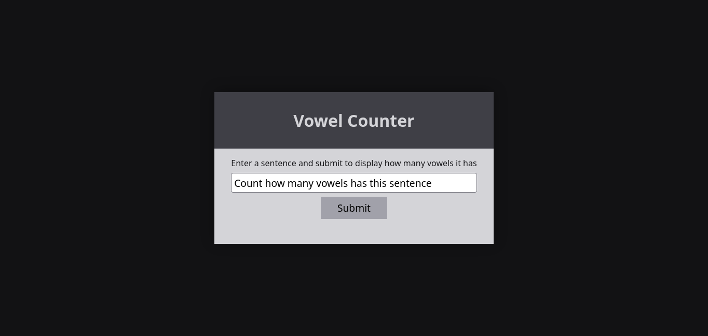
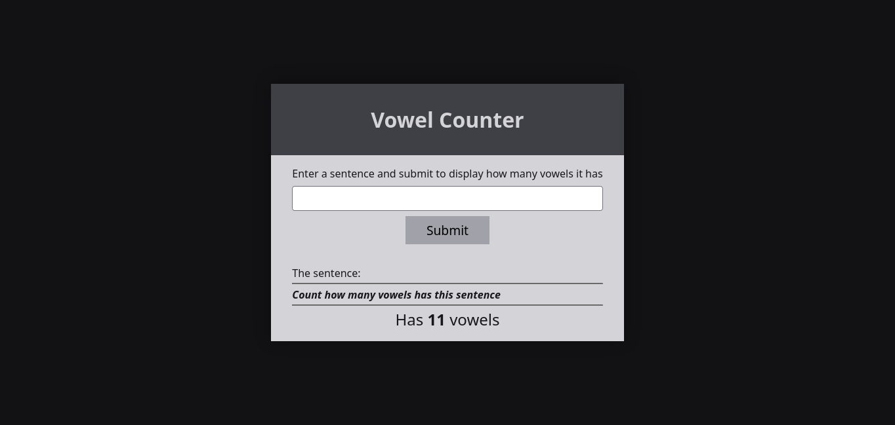

<strong><h1 align="center">Vowel Counter</h1></strong>
<p align="center"><strong>Project developed for a technical challenge/test</strong></p>

<p align="center">
  
</p>
<p align="center">
  
</p>

## 🚀 Challenge
Create a function that counts the number of vowels in a string. The program should ask the user for a sentence and display how many vowels it has.

## 🛰️ Technologies
This project was developed with the following technologies:

- React
- Typescript
## 💻 Installation / How to use
- Clone this repository:
   ```bash
   git clone https://github.com/jairokoning/vowel-counter.git
   ```
- Install dependencies:
   ```bash
   npm i
   ```
- Start the application
   ```bash
   npm run dev
   ```
- Open http://localhost:3000 with your browser to see the result.
---

_Developed with_ 😀 _and_ ❤️ _by [Jairo Koning](https://linkedin/in/jairokoning)_